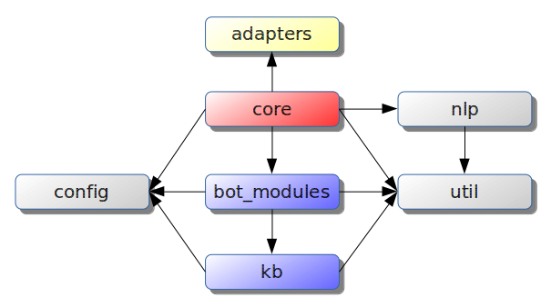

# MBot

A modular bot framework.

Home Page (documentation): [https://liciojr.github.io/mbot](https://liciojr.github.io/mbot)

Git Repository: [https://github.com/liciojr/mbot](https://github.com/liciojr/mbot)

NPM Package: [https://www.npmjs.com/package/mbot](https://www.npmjs.com/package/mbot)

## Setup

### Quick Start

1. Clone the [repository](https://github.com/liciojr/mbot);
2. Install dependencies: `npm i`
3. Start with adapters/console (*): `npm start`

(*) other adapters (see "Adapters" section for custom configuration):
* adapters/rest: `npm run start-rest`
    * see `adapter` key configuration in **config/core/brain.rest.json**
* adapters/xmpp: `npm run start-xmpp`
    * see `adapter` key configuration in **config/core/brain.xmpp.json**
    * require a XMPP server (e.g. [Openfire](http://www.igniterealtime.org/projects/openfire/))

### New Project

1. Create a project:
    * `npm init -y`;
2. Install library and dependencies:
    * `npm i --save mbot`
3. Create json configuration files in **/config** (default 'dev' environment);
4. Create javascript modules in **/bot_modules** and **/kb**;
5. Create app.js with:
    * `require('mbot').init();`
6. Run:
    * `node app.js`

## Features

* modular structure (e.g. communication, knowledge base, classifier, utilities), facilitating collaborative working;
* centralized multi-environment configuration;
* flexible integrated logging;
* universal database abstraction (Sails Waterline) for relational and NoSQL databases;
* global filesystem overlay;
* automatic lifecycle management with asynchronous init/dispose;
* extensible adapters (e.g. console, rest, xmpp, test);
* helper plugins (e.g. logger, HTML parser/scraper, spreadsheet reader, test stub, HTTP/HTTPS consumer).

### Configuration

* plain [JSON](http://www.json.org/) format;
* standard path convention (`/config/dir/name.{env}.json`);
* extensible configuration, with **MBOT_NODE_ENV** and **MBOT_NODE_ENV_ALT** environment variables (allow partial redefinition, with ALT fallback);
* built-in environments:
    * `dev`: development (default)
    * `tmp`: temporary (git ignored)
    * `tst`: test automation (with nlp/hashtag)
    * `tst_bayes`: test automation (with nlp/bayes)
    * `rest`: rest adapter
    * `xmpp`: xmpp adapter
    * `template`: custom template
    * `prd`: production (suggested)
* automatic init setup with `config` modules property;
* system variable support in any value, replaced at runtime in `mbot.config` loader:
```json
{
    "key": "${ENV_VAR_X}"
}
```

### Logging

* 'util/logger' helper with integrated configuration;
* shared use with core `mbot.logger()`;
* allow multiple transport channels and categories.

### Database Abstraction

* 'util/db' helper for direct [Waterline](https://github.com/balderdashy/waterline) integration (without [Sails](http://sailsjs.com/));
* multiple relational (MySQL, PostgreSQL, FileMaker, Apache Derby, ...) and NoSQL (MongoDB, Redis, OrientDB, ...) database adapters, with same interface;
* multiple source model integration;
* allow [custom adapters](http://sailsjs.com/documentation/concepts/extending-sails/adapters/custom-adapters) creation;
* built-in (zero configuration) disk/memory adapter for fast prototyping and test automation.

### Overlay and Lifecycle Management

* core function `mbot.load` uses filesystem overlay (`mbot.path`) to import (require) a module, and save its init/dispose callback (if exists);
* async single/multiple initialization, to instant or previous loaded modules (`mbot.init`);
* async global dispose (`mbot.dispose`).

### Adapters

Modules in **/adapters** folder, with `init` and `onEvent` (observer pattern) functions, allowing easily creation of custom adapters.

Choose and configure in **config/core/brain.{env}.json** file, at `adapter.type` key.

Built-in adapters:

* **console.js** - command-line interface adapter, configuration example:
```json
    "adapter": {
        "type": "console",
        "from": "admin@localhost",
        "prompt": "[question] "
    }
```
* **xmpp.js** - XMPP protocol adapter, configuration example:
```json
    "adapter": {
        "type": "xmpp",
        "setPresence": {
            "status": "chat",
            "text": "alpha version"
        },
        "settings": {
            "jid": "mbot@localhost",
            "password": "${MBOT_XMPP_PWD}",
            "host": "localhost",
            "port": 5222            
        }
    }
```
* **rest.js** - REST service adapter, configuration example:
```json
    "adapter": {
        "type": "rest",
        "get": "/mbot",
        "port": 8080,
        "headers": {
            "Access-Control-Allow-Origin": "*"
        }
    }
```
* **test.js** - Test automation adapter, configuration example:
```json
    "adapter": {
        "type": "test",
        "from": "usr1"
    }
```

## Architecture

The solution has the following structure:



* **config**: central configuration directory ({module}.{environment}.json format);
* **adapters**: front-end modules (e.g. XMPP, REST, Console);
* **bot_modules**: communication modules (specialized dialogs);
* **kb**: [knowledge base](https://en.wikipedia.org/wiki/Knowledge_base);
* **lib/core**: asynchronous core and subsystems facade;
* **nlp**: [natural language processing](https://en.wikipedia.org/wiki/Natural_language_processing) modules;
* **util**: utilities (e.g. HTML extractor, spreadsheet reader, HTTP consumer, database integration, logger).

Applications should focus on **bot_modules** and **kb** sections. 

### Workflow Summary

A main controller (`lib/core/brain`) execute the following tasks:

1. read `config/core/brain.{env}.json` configuration;
2. load model and open database configured in `db` key;
3. invoke core loader (`lib/index`) to fetch configured modules in `loader.bot_modules` key from `config/index.{env}.json`;
4. load language module configured in `nlp` key;
4. invoke core asynchronous global init;
5. load and start adapter configured in `adapter` key;
6. register adapter `onReply` event and wait for requests.

For each request, the main controller creates a **dialog** object with some properties:

```javascript
{
    from: 'user abc',
    text: 'question xyz',
    state: {},
    action: '',
    entities: [],
    nonEntities: []
}
```

The NLP module fills entities/nonEntities fields information, and returns a list of compatible intents (**communication module** / **action**). By default, following rules apply:

* if none or 3+ modules are compatible, will return `brain.message.unknown` configured message;
* if 2 modules/actions are compatible, will return `brain.message.refine` and respective help text, for user refinement;
* if only one module/action is compatible, it will be invoked to format a reply.

A communication module can use the `state` dictionary to hold user/session information (see `bot_modules/examples/echo_bot`).

### Collaborative Work

The framework was designed to allow multiple concurrent development on the same repository. To accomplish this, follow these steps:

* define a user tag, example: `u01`;
* clone `bot_modules/templates/hello_bot` to `bot_modules/u01/hello_bot`, replacing "template" with "u01" in *keywords* array:
```javascript
module.exports = {
    keywords: ['u01'],
    reply
}
```
* clone `config/index.template.json` to `config/index.u01.json`, replacing "templates" with "u01" in "loader.bot_modules" section:
```javascript
{
    "loader": {
        "bot_modules": {
            "u01": "*"
        },
```
* define environment variable **MBOT_NODE_ENV** with **u01**, and start MBOT;
* type "u01" to receive a welcome message;
* to customize main controller features, clone `config/core/brain.template.json` to `config/core/brain.u01.json`, replacing whatever you want;
* any Knowledge Base modules in `kb/*` can be used, or a new directory `kb/u01` can be created to add new ones.

## Bot Modules

### NLP Modules

Configure a Natural Language Processing module with `nlp.type` key in `config/core/brain.{env}.json` file, example:

```json
    "nlp": {
        "type": "bayes",
        "cache": ".tmp/bayes_cache.json",
        "stemmer": "node_modules/natural/lib/natural/stemmers/porter_stemmer.js"
    }
```

Built-in modules:

* `nlp/hashtag`: deterministic classifier, based on rules;
* `nlp/bayes`: natural classifier, with Naive-Bayes algorithm.

To create a NLP module, implement a `classify` function in `nlp` folder, with 2 arguments: a dialog and a callback. Remember to configure `nlp.type` key.

Current Named Entity Recognition use a simplified rule set:

* text between quotes, example:
    * `how old is "Peter Parker"?`
        * entities `["Peter Parker"]`
* words starting with digit, example:
    * `sum 5 and 6`
        * entities `["5", "6"]`
* words starting with uppercase, except at the beginning of a sentence, and with more than one letter, example:
    * `What is Peter phone?`
        * entities `["Peter"]`

### Communication Modules

Files under `bot_modules` folder, with following interface:

* Required: 
  * `keywords` property (string array): first element required (master keyword for deterministic classifier). Other keywords used for natural language classifier;
  * `reply(dialog, callback)` function;
* Optional:
  * `actions` property (object): action dictionary, each entry with keywords string/array;
  * `help` property (string): help text.

Examples:

* **currency_bot.js** - display a list of countries related to a currency symbol, example:
    * `which countries use "GBP" currency?`
    * `"BRL" country`
* **degree_bot.js** - temperature conversion bot, examples:
    * `95 to celsius`
    * `35 to fahrenheit`
* **echo_bot.js** - simple echo message, example:
    * `some echo here`
* **geo_bot.js** - display your/some IP address location, examples:
    * `my address?`
    * `ip of "github.com"`
* **google_bot.js** - show latest technology news from google site, example:
    * `tech news`
* **hobby_bot.js** - user hobby list manager, examples:
    * `please, include a new hobby for me: Carpentry`
    * `show my hobbies`

### Knowledge Base Modules

Any file under `kb` folder. Examples:

* **currency_kb.js** - use `util/spreadsheet` helper to read information from a spreadsheet file;
* **degree_kb.js** - use `soap` external library to consume a public SOAP webservice at [webservicex.net](http://www.webservicex.net/ConvertTemperature.asmx?WSDL);
* **geo_kb.js** - use `util/http` helper to consume a public REST service at [http://freegeoip.net](http://freegeoip.net);
* **google_kb.js** - use `util/html` helper to extract information from a [Google HTML page](https://news.google.com/news/section?topic=t&ned=ca);
* **hobby_kb.js** - use `util/db` helper to interact with a database.

## Tests

First time, type `npm install` to fetch dependencies, then type `npm test`.

Test support:
* **adapters/test.js**: expose "request" method for test automation;
* **util/test.js**: utility helper for test implementation, compatible with Mocha framework;
* **test/examples/***: implementation examples.

## License

GNU Lesser General Public License (LGPL), version 3 or later.

See the LICENSE file in the root directory or [https://www.gnu.org/licenses/lgpl.html](https://www.gnu.org/licenses/lgpl.html).
